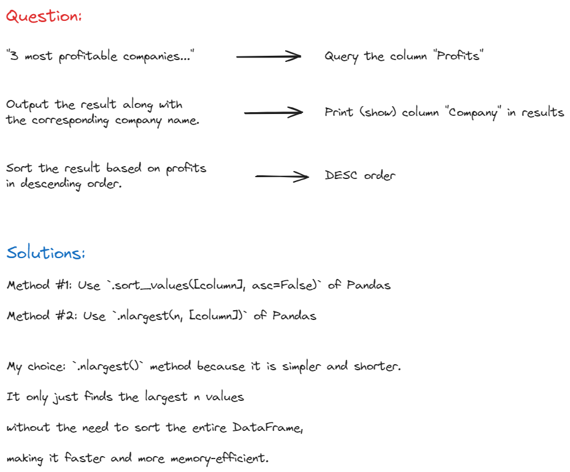

# Most Profitable Companies

- Forbes
- Medium
- ID: 10354

## Question

- Find the 3 most profitable companies in the entire world.
- Output the result along with the corresponding company name.
- Sort the result based on profits in descending order.
- DataFrame: `forbes_global_2010_2014`.

## My solution



My code: 

```python
# Import library
import pandas as pd

# Check the dataframe
forbes_global_2010_2014.head()

# Find the top 3 most profitable companies in the dataset
df_top3 = forbes_global_2010_2014.nlargest(3, "profits")

# Select and display only the 'company' and 'profits' columns
df_top3[["company", "profits"]]
```

Note that I use the `nlargest` method because it only sorts and selects the top 3 companies based on their profits without a need to sort the entire dataframe.

## Alt. solution:

Another method that I thought of is using `.sort_values()` method as explained above. Here's my code if I go that path:

```python
# Import library
import pandas as pd

# Check the dataframe
forbes_global_2010_2014.head()

# Sort the dataframe based on 'profits'
sorted_df = forbes_global_2010_2014.sort_values(by="profits", ascending=False)

# Filter top 3 rows
sorted_df.head(3)

# Show results
sorted_df.head(3)[["company", "profits"]]
```

As you can see, the `.sort_values()` method will sort the entire dataframe before filtering the top 3 rows. This is not as efficient as using the `.nlargest()` method of Pandas.

## SS' solution:

I find the official solution by StrataScratch is the most complex unnecessarily:

```python
result = forbes_global_2010_2014.groupby('company')['profits'].sum(
).reset_index().sort_values(by='profits', ascending=False)

result['rank'] = result['profits'].rank(method='min', ascending=False)

result = result[result['rank'] <= 3][['company', 'profits']]
```

### :grey_question: What's your thought?