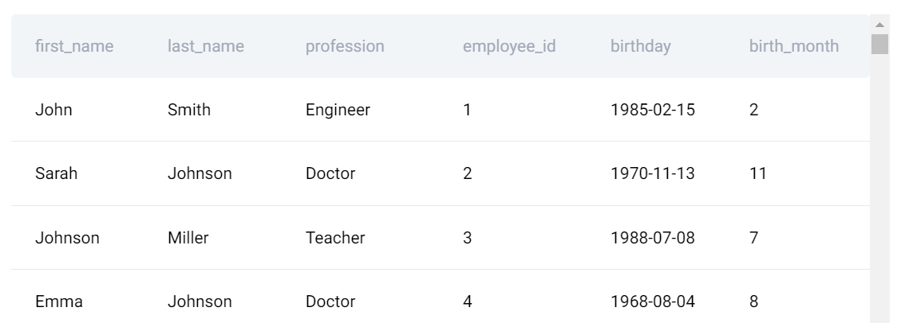

# Finding Doctors

- Interview Question Date: May 2023
- Google
- Easy
- ID 10356

## Question

Find doctors with the last name of 'Johnson' in the employee list. The output should contain both their first and last names.

- DataFrame: employee_list.
- employee_list



## My Solution

I used SS' framework to break down the problem and answer it.

### Exploring the Dataset

The pandas DataFrame called "employee_list" contains 6 columns. We will only ocus on 3 columns: `first_name`, `last_name`, and `profession` because they are related to what the question asks.

Notice that the question tries to trick us when having 'Johnson' also appear in `first_name` column.

### Writing out the Approach

In Python code:
```python
# Import your libraries (pandas)

# Check out the dataframe

# Filter the dataframe to only select 'Johnson' in last_name and 'Doctor' in profession columns

# Show the final dataframe with only 2 columns: first_name and last_name
```

### Coding the Solution

```python
# Import your libraries
import pandas as pd

# Check out the dataframe
employee_list.head()

# Create a dataframe of Johnson/Doctor
johnson_doctor = employee_list[(employee_list['profession'] == "Doctor") & (employee_list['last_name'] == "Johnson")]

# Show the final dataframe
johnson_doctor[['first_name', 'last_name']]
```