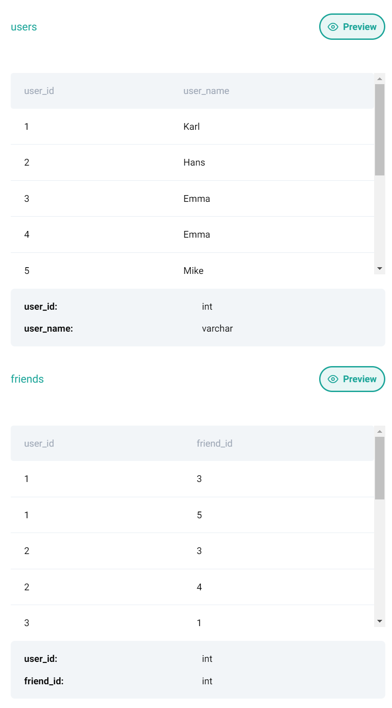

# Common Friends Script

- Interview Question Date: December 2023
- Google
- Easy
- ID 10365

## Question

You are analyzing a social network dataset at Google. Your task is to find mutual friends between two users, Karl and Hans. There is only one user named Karl and one named Hans in the dataset.



The output should contain 'user_id' and 'user_name' columns.

## Python codes

```python
# Find the user ID for Karl and Hans separately
karl_id = users[users['user_name']=="Karl"].iloc[0][0]
hans_id = users[users['user_name']=="Hans"].iloc[0][0]

# Find friends of Karl and Hans
karl_friends = friends[friends['user_id']==karl_id]
hans_friends = friends[friends['user_id']==hans_id]

# Find mutual friends' ID
mutual_friend_ids = karl_friends.merge(hans_friends, how='inner', on='friend_id').iloc[0][1]

# Get mutual friends' names
mutual_friend_names = users[users['user_id']==mutual_friend_ids]

# Print mutual friends' names
mutual_friend_names
```
