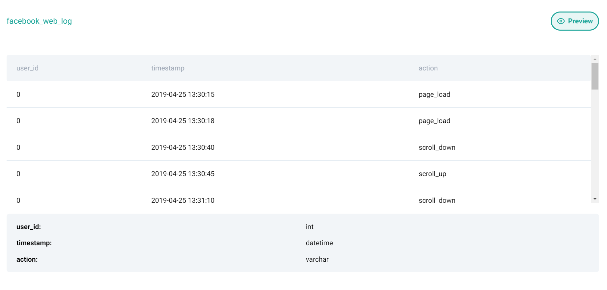

# User Scroll Up Events

- Meta
- Easy
- ID 9787

## Question 

Find all users that have performed at least one `scroll_up` event.

DataFrame: facebook_web_logExpected.

Output Type: pandas.DataFrame.



## Solution

### Python 

```python
# Find user_id that have at least one 'scroll_up' event
facebook_web_log[facebook_web_log['action']=='scroll_up'][['user_id']].drop_duplicates()
```

