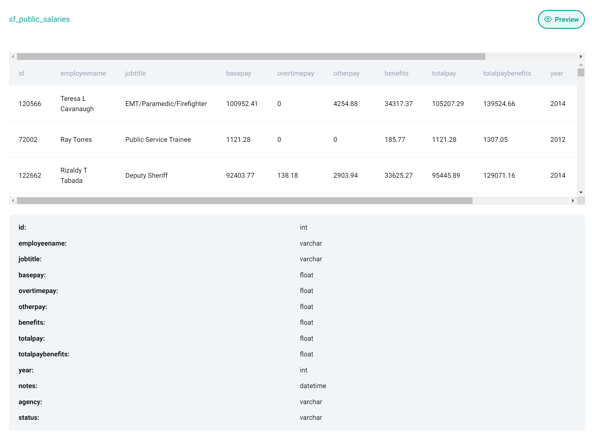

# Find job titles which had 0 hours of overtime


- City of San Francisco
- Easy
- ID 9973

Find job titles that had 0 hours of overtime.
Output unique job title names.

DataFrame: sf_public_salaries.
Expected Output Type: pandas.DataFrame.



## Python script

```python
# SOLUTION 1 
no_overtime = sf_public_salaries[sf_public_salaries['overtimepay']==0]['jobtitle']
pd.unique(no_overtime)

# SOLUTION 2 - method chaining
result = sf_public_salaries[sf_public_salaries['overtimepay'] == 0.0][['jobtitle']].drop_duplicates()
```